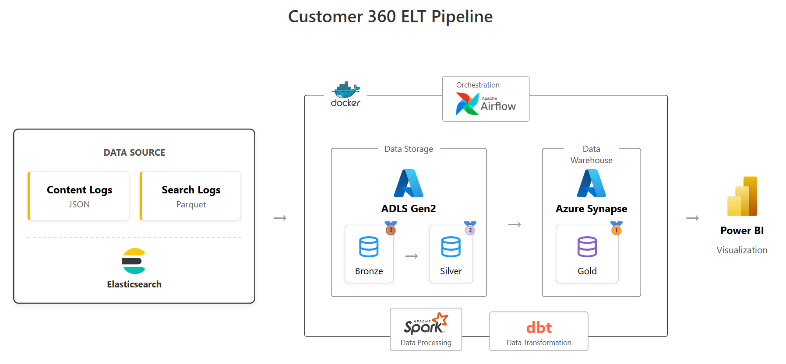
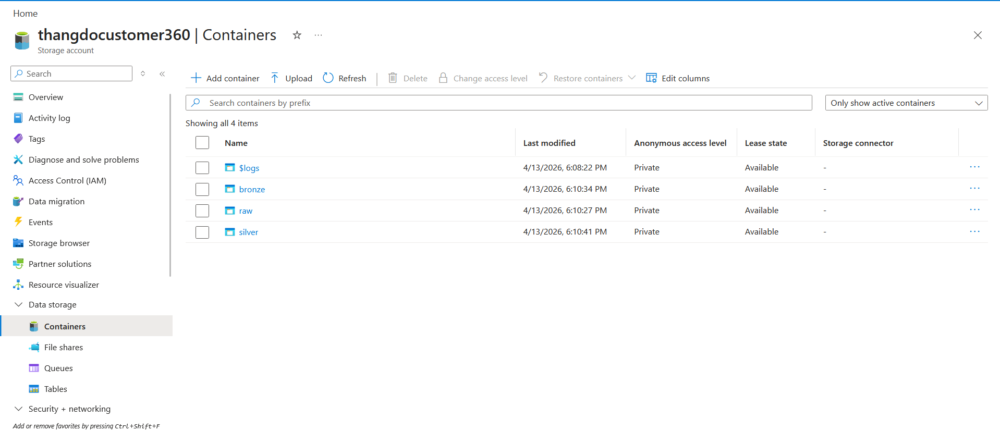
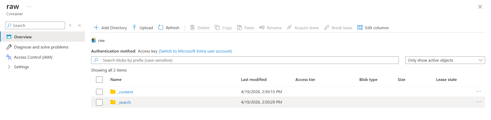
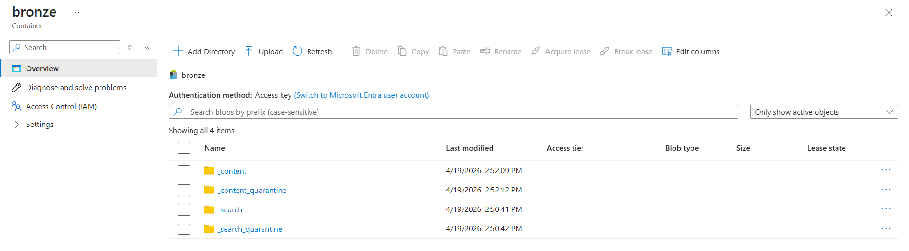
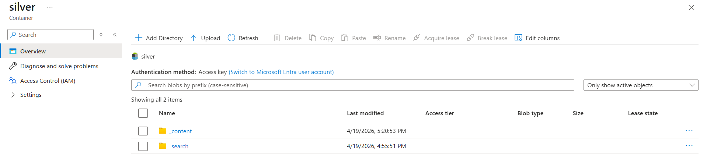
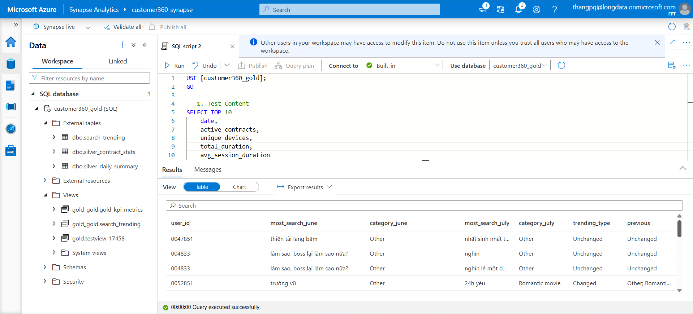
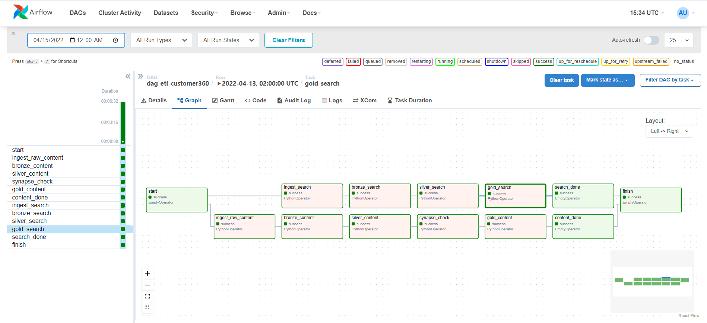
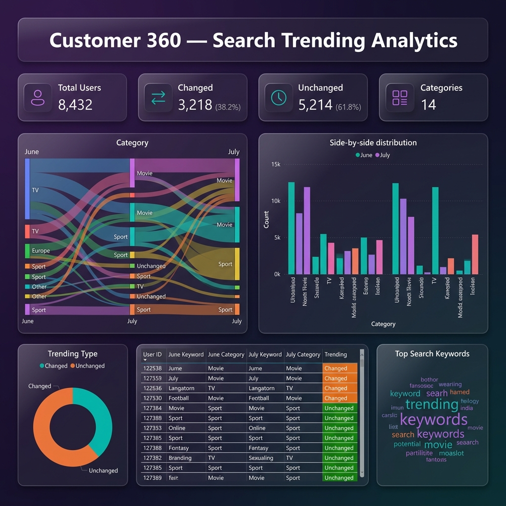

# Customer 360 — Unified ELT Pipeline

> An end-to-end ELT pipeline ingesting **two data sources** (Content logs & Search logs) into an Azure Data Lakehouse. Transformed via the **Medallion Architecture** using PySpark and compiled into Serverless SQL Analytics with dbt — serving actionable insights directly to Power BI Dashboards.

---

## Executive Summary

- **Unified ELT Architecture:** Processes two distinct, massive datasets via a single parameterized Airflow DAG into shared Medallion containers (Raw/Bronze/Silver/Gold).
- **Robust Idempotency:** Implements strict `_load_date` PySpark partitioning, enabling fail-safe re-runs, historical backfills, and no-duplicate guarantees.
- **Fail-closed Data Quality:** Embedded rule engine automates data sanity, rejecting bad payload events and halting the pipeline automatically upon high threshold breaches.
- **Analytical Deep-Dives:** Engineered complex PySpark semantic aggregations—including cross-month search trend tracking and viewing habit clustering.

---

## 1. Project Overview

| Item                               | Detail                                                                                       |
| ---------------------------------- | -------------------------------------------------------------------------------------------- |
| **Purpose**                  | Ingest, cleanse, and transform Content viewing logs + Search keyword logs into business KPIs |
| **Data Source 1 — Content** | JSON files exported from Elasticsearch (~10K–20K records/file), April 2022                  |
| **Data Source 2 — Search**  | Parquet files exported from Elasticsearch (search keyword logs), June–July 2022             |
| **Scale**                    | Content: ~300K–600K records/day. Search: ~50K records/day                                   |
| **Output**                   | Gold layer KPIs →**2 Power BI Dashboards** (Content Analytics + Search Trending)      |
| **Dev Environment**          | Docker (Spark + PostgreSQL + Airflow) on local machine                                       |
| **Prod Environment**         | Azure (ADLS Gen2 + Azure Synapse Analytics Serverless SQL)                                   |

---

## 2. Architecture & Tech Stack



### Tech Stack

| Category                    | Technology                 | Role                                          |
| --------------------------- | -------------------------- | --------------------------------------------- |
| **Data Source**       | Elasticsearch JSON/Parquet | Origin of Content + Search log records        |
| **Cloud Storage**     | Azure Blob / ADLS Gen2     | Immutable landing zone & Parquet partitioning |
| **Data Warehouse**    | Azure Synapse Serverless   | Gold layer only — external table parsing     |
| **Orchestration**     | Apache Airflow             | Single DAG triggering PySpark scripts         |
| **Processing Engine** | PySpark (`spark-submit`) | Core transformation frameworks via DataFrames |
| **Transformation**    | dbt Core                   | Validates and compiles Synapse SQL logic      |
| **BI & Serving**      | Power BI                   | Dashboards executing via DirectQuery          |

### Design Rationale

- **PySpark Extensibility**: Handles 10M+ rows via Executor JVMs directly within Docker, solving Out-Of-Memory limitations innate to Pandas. Enforces rigid schema schemas natively upon ADLS reads.
- **Serverless SQL vs Compute**: Offloads all heavy structural computation to PySpark while delegating solely "business-ready KPI rendering" to Synapse SQL pools via dbt.

---

## 3. Data Model

### Container Layout


Both Content and Search sources share standard containers (`raw`, `bronze`, `silver`), isolated fundamentally via `_content/` and `_search/` prefixed folder domains.

### 🥉 Raw Layer



- Append-only immutable landing zone. Partitioned intrinsically by execution extraction `_load_date`.

### 🥈 Bronze Layer



- **Content Metrics**: Extracts schema mapping for `total_duration` (INT64), `app_name` (STRING).
- **Search Metrics**: Normalizes semantic formats for `user_id` (STRING), `keyword` (STRING).
- Responsible for discarding malformed payloads into `_quarantine` segments.

### 🥇 Silver Layer



- **Content (7 Tables):** Aggregation matrices — `contract_stats`, `daily_summary`, `contract_most_watch`, `contract_taste`, `contract_type`, `contract_activeness`, `contract_clinginess`.
- **Search (1 Table):** `search_trending` (Evaluating chronological preference switches across June-July thresholds).

### 🏆 Gold Layer



- Compiled iteratively via `dbt`, forming DirectQuery connection bridges for PowerBI BI.

**Partitioning Strategy**: Every task targets a single `_load_date` parameter string. Outputs overwrite respective destination directories seamlessly eliminating duplicate overlaps dynamically.

---

## 4. ETL Implementation

### Workflow Snippets

All business transformations reside in cleanly decoupled routing abstractions based on system `data_type` signatures.

```python
def run_bronze(ds=None, data_type="content"):
    # 1. Fetch JSON or Parquet from Raw
    df, spark, local_tmp = load_raw(ds, data_type=data_type)
  
    # 2. Gate-keep invalid inputs programmatically
    valid, invalid, report = transform(df, data_type=data_type)
  
    # 3. Synchronize to ADLS
    write_bronze(valid, invalid, ds, data_type=data_type)
```

### Execution Modes

| Mode            | Behavior Execution                                | Standard Use Case             |
| --------------- | ------------------------------------------------- | ----------------------------- |
| `incremental` | Orchestrates Bronze → Silver → Gold for `T-1` | Daily continuous schedule     |
| `date_range`  | Fan-outs incrementals over a looped index         | Historical backfills          |
| `full`        | Broad-wipes available partitions globally         | Disaster Recovery / Migration |

### Triggering Airflow Jobs

1. Access the Airflow UI at `http://localhost:8080` (admin/admin).
2. Unpause `dag_etl_customer360`.
3. In trigger configurations, define custom historical dates (e.g. `2022-04-15` or `2022-06-05`). The system fan-outs data processing concurrently.
   

### Data Quality (DQ) Thresholds

- **Content Pipeline:** Gates metrics natively if `contract IS NULL`, `mac IS NULL`, or `total_duration < 0`. Hard fails if `0.05` (5%) rejection bounds are crossed.
- **Search Pipeline:** Restricts payload vectors lacking semantic traces. Halts completely if exceeding a `0.40` (40%) garbage collection tolerance (due to historically high un-linked guest search traffic).

---

## 5. Power BI Dashboards

> 🔗 **Live Dashboard:** [View on Power BI Service](https://app.powerbi.com/reportEmbed?reportId=3d4041e4-1098-4b35-ab70-8f45b31b5441&autoAuth=true&ctid=6ac2ad06-692c-4663-b7af-a9ff2a866d0c)

### Content Analytics Dashboard


- **KPI Metrics**: Active Contracts, Avg Session Duration, Unique Devices, Total Viewing Hours.
- **Contract Segmentation**: Content Type Distribution, Daily Viewing Trend, Clinginess & Activity segments, and Taste profile matrix.

### Search Trending Dashboard



- **Evolution Visualization**: Traces structural categorical transitions between consecutive months mapping semantic intent shifts.
- Provides deep-dives into Top keyword trends, Changed vs Unchanged loyalty splits, and keyword-to-category associations.

---

## 6. Folder Structure

```text
customer360-bigdata-pipeline/
├── dags/
│   └── dag_etl_customer360.py          # Unified DAG Orchestration Core
├── src/
│   ├── utils/
│   │   └── azure_utils.py               # Shared API IO / Remote connections
│   ├── bronze/                          # Entry logic: load_raw, transform, write  
│   ├── silver/                          # PySpark enrichment abstractions
│   ├── search/
│   │   └── category_mapping.py          # Keyword dictionary normalization
│   ├── dq/
│   │   └── evaluate.py                  # Threshold + Predicate constraint engine
│   └── scripts/
│       └── run_{layer}.py               # Target executable hooks for Airflow
├── dbt/
│   └── customer360/
│       └── models/                      # Synthesized Synapse External definitions
├── docker/
│   └── docker-compose.yml               # Complete dev-container blueprint
├── images/ 
└── README.md
```
